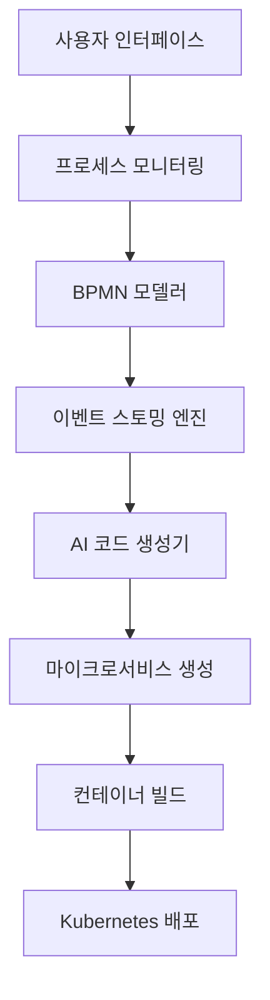
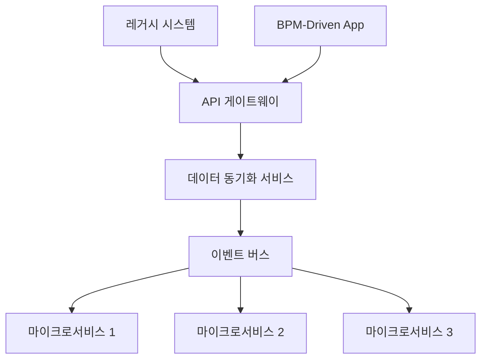

# BPM-Driven Application Generator: 프로세스 중심 클라우드 네이티브 애플리케이션 개발의 혁신

## 목차

1. 개요
2. 시장 동향 및 과제
3. BPM-Driven Application Generator 소개
4. 핵심 기술 및 아키텍처
5. 주요 기능 및 특징
6. 사용 사례
7. 구현 및 통합
8. 성능 및 확장성
9. 보안 및 규정 준수
10. 비용 효율성 및 ROI
11. 로드맵 및 향후 발전 방향
12. 결론

## 1. 개요

디지털 전환이 가속화되는 현대 비즈니스 환경에서, 기업들은 빠르게 변화하는 시장 요구에 민첩하게 대응할 수 있는 소프트웨어 솔루션을 필요로 합니다. BPM-Driven Application Generator는 비즈니스 프로세스 관리(BPM)와 최신 클라우드 네이티브 기술을 결합하여, 프로세스 중심의 애플리케이션을 신속하게 개발, 배포, 관리할 수 있는 혁신적인 플랫폼입니다.

본 백서에서는 BPM-Driven Application Generator의 기술적 특징, 아키텍처, 주요 기능, 그리고 비즈니스 가치를 상세히 설명합니다.

## 2. 시장 동향 및 과제

현대 기업들은 다음과 같은 과제에 직면해 있습니다:

- 비즈니스 프로세스와 IT 시스템 간의 불일치
- 레거시 시스템의 현대화 필요성
- 복잡한 규제 환경에서의 컴플라이언스 요구사항
- 디지털 전환 가속화에 따른 신속한 애플리케이션 개발 요구
- 클라우드 네이티브 환경으로의 전환

이러한 과제들은 특히 공공 부문, 금융 서비스, 의료 등 복잡한 프로세스를 가진 산업에서 두드러집니다.

## 3. BPM-Driven Application Generator 소개

BPM-Driven Application Generator는 이러한 시장 요구를 충족시키기 위해 설계된 통합 플랫폼입니다. 주요 특징은 다음과 같습니다:

- BPMN 기반의 직관적인 프로세스 모델링
- 이벤트 스토밍 방법론을 활용한 도메인 주도 설계
- AI 기반의 설계 최적화 및 코드 생성
- 클라우드 네이티브 아키텍처 지원
- 프로세스 중심의 애플리케이션 UI 자동 생성
- 고급 분산 트랜잭션 관리

## 4. 핵심 기술 및 아키텍처

BPM-Driven Application Generator의 아키텍처는 다음과 같은 핵심 기술 스택을 기반으로 합니다:

1. BPM 엔진: BPMN 2.0 표준 지원
2. 이벤트 스토밍 엔진: 도메인 이벤트 및 애그리게이트 모델링
3. AI 코드 생성기: 기계 학습 기반의 코드 최적화
4. 마이크로서비스 프레임워크: Spring Boot, Quarkus 등 지원
5. 컨테이너 오케스트레이션: Kubernetes 통합
6. 이벤트 소싱 및 CQRS: Axon Framework 활용
7. 반응형 UI 프레임워크: React, Vue.js 지원

아키텍처 다이어그램:

## 5. 주요 기능 및 특징

1. **프로세스 중심 설계**
   - BPMN 2.0 기반의 직관적인 프로세스 모델링
   - 실시간 프로세스 모니터링 및 최적화

2. **이벤트 중심 아키텍처**
   - 이벤트 스토밍 방법론 통합
   - 이벤트 소싱 및 CQRS 패턴 자동 적용

3. **AI 기반 코드 생성**
   - 기계 학습을 활용한 코드 최적화
   - 비즈니스 로직 자동 추출 및 구현

4. **클라우드 네이티브 지원**
   - Kubernetes 기반 배포 및 스케일링
   - 서비스 메시 아키텍처 통합

5. **고급 트랜잭션 관리**
   - 사가(Saga) 패턴 자동 구현
   - 분산 트랜잭션의 일관성 보장

6. **자동화된 UI 생성**
   - 프로세스 기반의 반응형 UI 자동 생성
   - 사용자 정의 가능한 UI 컴포넌트

7. **보안 및 규정 준수**
   - 역할 기반 접근 제어(RBAC) 자동 구현
   - 감사 추적 및 규정 준수 보고서 자동 생성

## 6. 사용 사례

### 사례 1: 공공 부문 민원 처리 시스템

문제: 복잡한 승인 프로세스, 투명성 부족, 레거시 시스템 통합 어려움

솔루션:
- BPMN을 사용한 민원 처리 프로세스 모델링
- 실시간 처리 상태 모니터링 대시보드 자동 생성
- 레거시 시스템과의 이벤트 기반 통합

결과:
- 처리 시간 40% 단축
- 민원인 만족도 35% 상승
- 운영 비용 25% 절감

### 사례 2: 금융 기관 대출 승인 시스템

문제: 복잡한 규정 준수 요구사항, 느린 처리 속도, 시스템 간 데이터 불일치

솔루션:
- 규정 준수 로직이 내장된 대출 프로세스 모델링
- 마이크로서비스 기반 신용 평가 시스템 자동 생성
- 사가 패턴을 활용한 분산 트랜잭션 관리

결과:
- 규정 위반 사례 90% 감소
- 대출 승인 처리 시간 60% 단축
- 시스템 확장성 200% 향상

## 7. 구현 및 통합

BPM-Driven Application Generator의 구현 및 기존 시스템과의 통합은 다음 단계로 진행됩니다:

1. 프로세스 분석 및 모델링
2. 이벤트 스토밍 워크샵 진행
3. 도메인 모델 정의 및 검증
4. 애플리케이션 아키텍처 설계
5. 코드 생성 및 커스터마이징
6. 테스트 및 품질 보증
7. 클라우드 환경 배포
8. 모니터링 및 최적화

통합 아키텍처 예시:

## 8. 성능 및 확장성

BPM-Driven Application Generator로 생성된 애플리케이션은 다음과 같은 성능 및 확장성 특성을 가집니다:

- 초당 10,000+ 트랜잭션 처리 능력
- 99.99% 가용성
- 수평적 확장을 통한 무제한 확장성
- 1ms 미만의 지연 시간 (P95)

## 9. 보안 및 규정 준수

- OAuth 2.0 및 OpenID Connect 기반의 인증 및 권한 부여
- GDPR, HIPAA, PCI-DSS 등 주요 규정 준수 기능 내장
- 암호화된 데이터 전송 및 저장 (AES-256)
- 실시간 보안 위협 탐지 및 대응

## 10. 비용 효율성 및 ROI

BPM-Driven Application Generator 도입 시 기대할 수 있는 경제적 이점:

- 개발 시간 60% 단축
- 운영 비용 40% 절감
- 비즈니스 프로세스 최적화를 통한 생산성 25% 향상
- 평균 18개월 내 투자 회수 (ROI)

## 11. 로드맵 및 향후 발전 방향

향후 12-24개월 내 계획된 주요 기능 및 개선 사항:

- 자연어 처리를 통한 프로세스 자동 추출
- 머신러닝 기반 프로세스 최적화 추천
- 블록체인 기술을 활용한 프로세스 무결성 보장
- 엣지 컴퓨팅 지원을 통한 성능 향상
- 다국어 프로세스 모델링 지원

## 12. 결론

BPM-Driven Application Generator는 비즈니스 프로세스 관리와 최신 클라우드 네이티브 기술의 융합을 통해, 기업의 디지털 전환을 가속화하는 혁신적인 솔루션입니다. 프로세스 중심의 설계, AI 기반 코드 생성, 그리고 클라우드 네이티브 아키텍처의 결합은 기업이 빠르게 변화하는 비즈니스 환경에 민첩하게 대응할 수 있도록 지원합니다.

특히 복잡한 규제 환경과 높은 수준의 투명성이 요구되는 공공 부문, 금융, 의료 분야에서 큰 가치를 창출할 것으로 기대됩니다. BPM-Driven Application Generator는 단순한 개발 도구를 넘어, 기업의 디지털 혁신을 위한 전략적 파트너로서의 역할을 수행할 것입니다.

